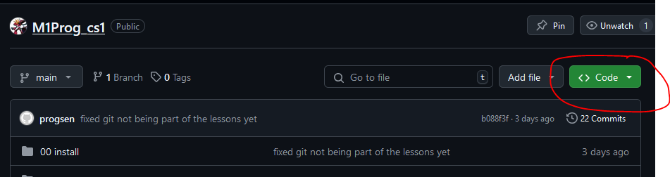
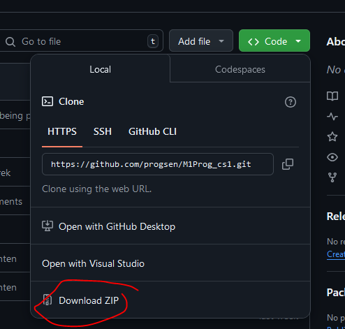
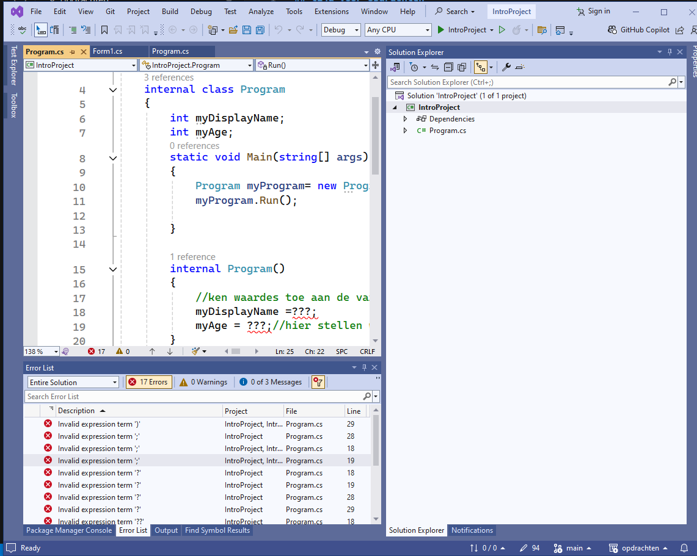
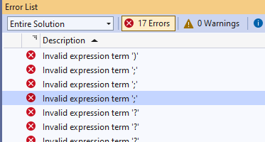
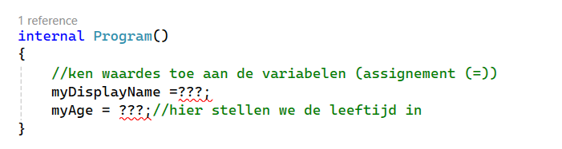

## tijd voor opdrachten

- lees deze uitleg: 
```
We gaan nu oefenen met C#, programmeren is vooral `DOEN`.
Hieronder lees je hoe we gaan oefenen
```

#### Voorbereiden 

- ga naar:
    https://github.com/progsen/M1Prog_cs1/tree/main
- click op de groene knop
    > 
- click op download zip
    > 

- pak de zip uit
    - nu kan je bij de solutions zoals `IntroProject.sln`


#### uitleg

- lees de uitleg hieronder: 

Hoe maak je deze opdrachten?

je begint bij de 01 .... directory
- open die directory 
    - `01 IntroProject` is de allereerste
- in die map vindt je een `***.sln`:
    >
    - bijvoorbeeld `IntroProject.sln` in de directory `01 IntroProject`
        - open die file, dan start visual studio op
        >

- je krijgt fouten te zien
    >
    - in code staan `???` vraagtekens, daar moet je wat invullen
    >
    - er staat ook `commentaar` in `groen`
        - daarin staat `WAT` je moet doen

#### Maak de opdrachten

- maak nu de opdrachten
- BUILD en RUN je opdrachten!
    - controlleer altijd of je code werkt

#### GIT

als je een opdracht af hebt:
- commit naar je github voor dit vak!
    > (commit & push)

## klaar?

- commit & push naar je git!