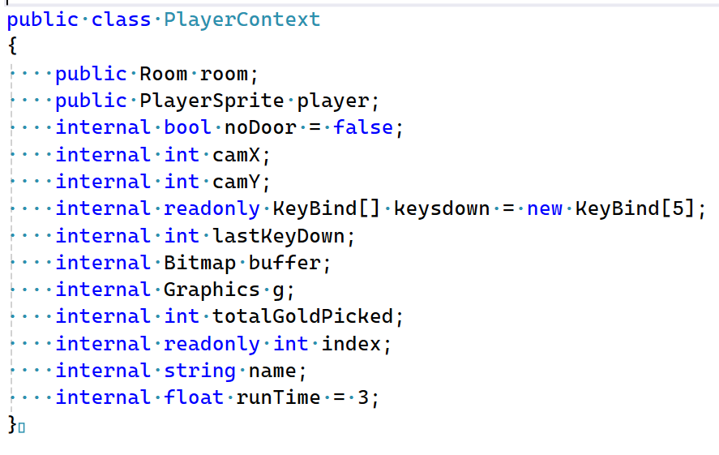

## Opdracht


- Maak een text file aan in je `M1Prog_cs1` directory met naam:
    - `TypeOpdracht.txt` 
- Schrijf nu in deze textfile:
    - alle `Types` op die je ziet in de code hieronder

```C#
//Hoe herkende je een Type ook al weer?
//Hint: int is bijvoorbeeld het type van de variable hieronder
 
int leeftijd;
```

- bekijk deze codefile:
    >
## klaar
- commit alles naar je github

