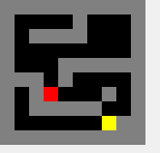
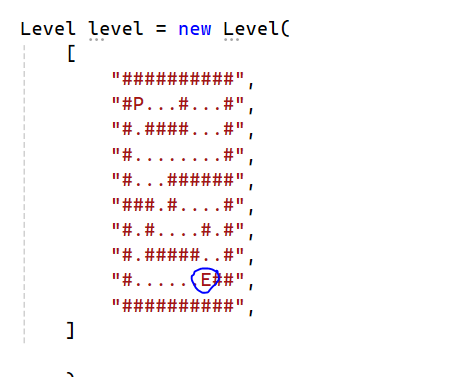
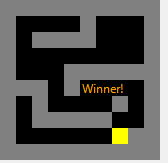

## squarecommand

> we gaan nu een speler object besturen via functions

- open de solution `SquareCommand.sln`

- zoek de kopjes in de code

## 1)
- bekijk Square.cs
    - lees de 4 Move... functions

- open `Form1.cs` (rechter muis -> view code)
- zoek:
    - // 1)
- vervang beide ???? met 1 van de 4 Move functions van player

> voorbeeld: 
> ()=>???? wordt
> ()=> player.MoveRight(level)

## testen

- start de applicatie op
- je ziet nu dit:
> 
- druk op spatie
    - de speler beweegt
    > 

## 2)

- open `Form1.cs` (rechter muis -> view code)
- zoek:
    - // 2)
- blijf Move calls toevoegen totdat:
    - de speler bij het einde komt 
        - dat is het vakje waar de 'E' staat 
    > 
- test het!
    - als je winner te zien krijgt ben je klaar!
    > 

## klaar

- commit & push naar je github        