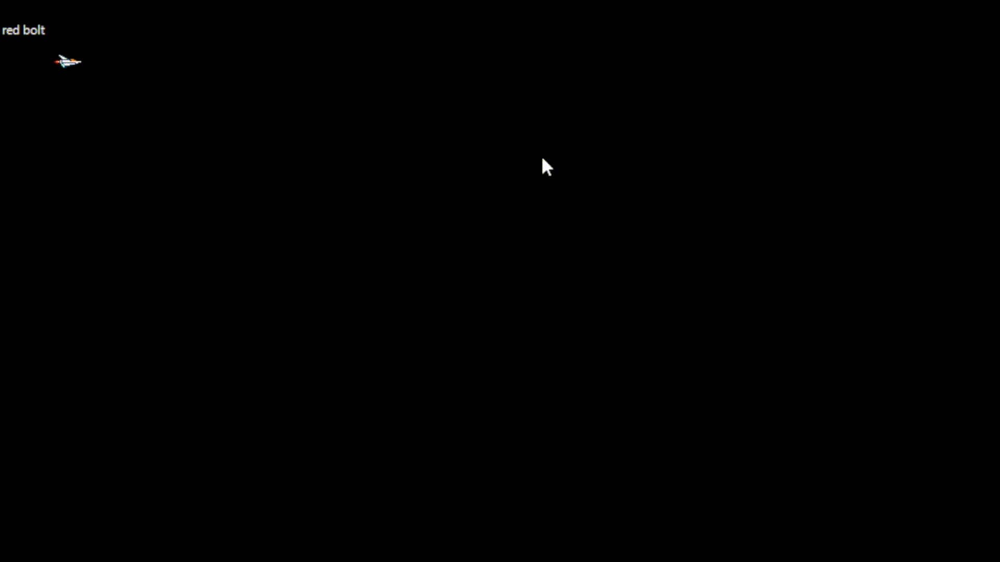

##

## DifferentMovement

- lees:
```
we gaan nu de bullet en weapons classes uitbreiden zodat we elke kogel een apart patroon kan hebben om langs te bewegen

```

- open de solution `Weapons.sln`

- lees deze uitleg:
    - dit is waar we naar toe werken:
    > 

## 1)
- open `Form1.cs` (rechter muis -> view code)
- zoek:
    - //1) 
        - zorg ervoor dat je bij een aantal van de weapons, een DirectionalMover gebruikt. 
            - Stel ook de X en Y van de mover in

## testen

- zoek in de applicatie met welke keys van het keyboard kan:
    - schieten
    - wapens wisselen
- run de applicatie
    - test of nu aparte plaatjes per wapen hebt

## Extra:

- probeer er nog een Mover bij te maken:
    - 1 die de kogel in een golf naar voren schiet

## klaar

- commit & push naar je github        